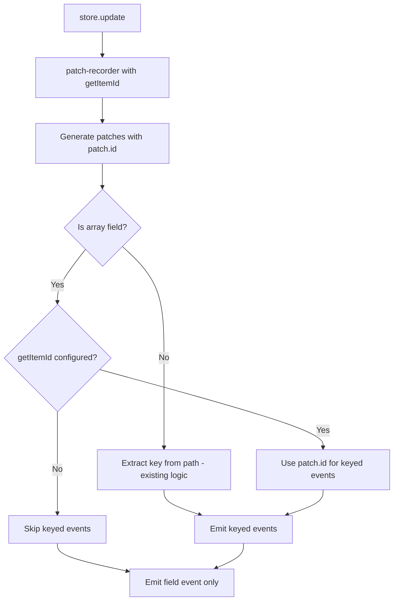

# Plan: ID-Based Keyed Events for Arrays

## Overview

Change the behavior of `onKeyed` for arrays to use **item identity** (via `patch.id`) instead of **array indices** (positional). This provides stable identity-based subscriptions that survive reordering, insertions, and deletions.

## Problem Statement

Currently, array keyed events use numeric indices:
```typescript
store.onKeyed('items:updated', 0, callback);  // Listen to index 0
```

This is problematic because:
1. **Position vs Identity**: Index 0 refers to different items after `shift()` or `unshift()`
2. **Unstable subscriptions**: After mutations, the subscription might fire for the wrong item
3. **Misleading semantics**: Users expect to track a specific item, not a position

## Solution

Use `patch.id` from `patch-recorder` when `getItemId` is configured:

```typescript
const store = createObservableStore<State>(
  { items: [{ id: 'a', text: 'A' }, { id: 'b', text: 'B' }] },
  {
    getItemId: {
      items: (item) => item.id  // Configure ID extraction for 'items' array
    }
  }
);

// Now keyed subscriptions use item ID
store.onKeyed('items:updated', 'a', callback);  // Listen to item with id='a'
```

## Key Behaviors

| Scenario | Current Behavior | New Behavior |
|----------|------------------|--------------|
| Arrays WITHOUT `getItemId` | Keyed events use index | Keyed events **disabled** |
| Arrays WITH `getItemId` | N/A | Keyed events use `patch.id` |
| Records | Keyed events use string key | No change |
| Objects | Keyed events use property name | No change |

## Implementation Steps

### Step 1: Update ObservableStoreOptions

**File:** [`packages/observator/src/index.ts`](packages/observator/src/index.ts:41)

```typescript
import { GetItemIdConfig } from './types.js';

export type ObservableStoreOptions = {
  createFunction?: CreateFunction;
  getItemId?: GetItemIdConfig;  // NEW: Configure ID extraction for array fields
};
```

### Step 2: Pass getItemId to patch-recorder

**File:** [`packages/observator/src/index.ts`](packages/observator/src/index.ts:34)

Modify `createFromPatchRecorder` to accept and pass `getItemId`:

```typescript
function createFromPatchRecorder<T extends NonPrimitive>(
  state: T,
  mutate: (state: T) => void,
  getItemId?: GetItemIdConfig,
): [T, Patches] {
  return [state, recordPatches<T>(state, mutate, { getItemId })];
}
```

Update the `CreateFunction` type to support this:

```typescript
export type CreateFunction = <T extends NonPrimitive>(
  state: T,
  mutate: (state: T) => void,
  getItemId?: GetItemIdConfig,
) => [T, Patches];
```

### Step 3: Track Array Fields

**File:** [`packages/observator/src/index.ts`](packages/observator/src/index.ts:86)

Add a private field to track which fields are arrays:

```typescript
class ObservableStore<T extends Record<string, unknown> & NonPrimitive> {
  private arrayFields: Set<string>;
  
  constructor(protected state: T, protected options?: ObservableStoreOptions) {
    // ...
    this.arrayFields = this.detectArrayFields();
  }
  
  private detectArrayFields(): Set<string> {
    const fields = new Set<string>();
    for (const key of Object.keys(this.state)) {
      if (Array.isArray(this.state[key as keyof T])) {
        fields.add(key);
      }
    }
    return fields;
  }
}
```

### Step 4: Modify Keyed Event Extraction

**File:** [`packages/observator/src/index.ts`](packages/observator/src/index.ts:484)

Update [`extractSecondKeysFromPatches`](packages/observator/src/index.ts:484) to use `patch.id` when available:

```typescript
private extractSecondKeysFromPatches(patches: Patches, isArrayField: boolean): Set<Key> {
  const keys = new Set<Key>();
  for (const patch of patches) {
    if (isArrayField) {
      // For arrays, use patch.id if available
      if (patch.id !== undefined && patch.id !== null) {
        keys.add(patch.id);
      }
      // If no patch.id, don't add any key (arrays without getItemId don't support keyed events)
    } else {
      // For non-arrays, use the second path element as before
      if (patch.path.length > 1) {
        keys.add(patch.path[1]);
      }
    }
  }
  return keys;
}
```

### Step 5: Update Event Emission Logic

**File:** [`packages/observator/src/index.ts`](packages/observator/src/index.ts:139)

Modify the keyed event emission in [`update()`](packages/observator/src/index.ts:122):

**Key Insight:** For arrays, we ONLY emit keyed events when `patch.id` is present. The `patch-recorder` library populates `patch.id` only when:
- A property of an item is updated (e.g., `items[0].text = 'new'`)
- A new item is assigned (e.g., `items[1] = {id: 'new', value: 1}`) - ID is from the NEW item

`patch.id` is NOT present for:
- Removals (`pop`, `shift`, `splice` that removes)
- Field replacement (`items = newArray`)
- Length changes

This means the logic is simple: **only emit keyed events for patches that have `patch.id`**.

```typescript
// Conditionally emit keyed events only when there are listeners
if (this.emitter.hasKeyedListeners(eventName)) {
  const isArrayField = this.arrayFields.has(fieldKey);
  
  // For arrays without getItemId, skip keyed events entirely
  if (isArrayField && !this.options?.getItemId?.[fieldKey]) {
    continue;  // Skip keyed events for this array field
  }
  
  const changedKeys = this.extractSecondKeysFromPatches(fieldPatches, isArrayField);
  
  // For NON-array fields only: handle field replacement and length reductions
  if (!isArrayField) {
    // If field was replaced, notify all registered keyed listeners
    if (replacedFields.has(fieldKey)) {
      const registeredKeys = this.emitter.getKeyedListenerKeys(eventName);
      for (const key of registeredKeys) {
        changedKeys.add(key as Key);
      }
    }
    
    // Handle length reductions (only for Records, not arrays)
    const reduction = lengthReductions.get(fieldKey);
    if (reduction) {
      for (let i = reduction.newLength; i < reduction.oldLength; i++) {
        changedKeys.add(i);
      }
    }
  }
  // For array fields: changedKeys only contains IDs from patches that have patch.id
  // No special handling for field replacement or length reductions - those don't have patch.id
  
  for (const changedKey of changedKeys) {
    this.emitter.emitKeyed(eventName, changedKey as any, fieldPatches as any);
  }
}
```

### Step 6: Update Type System

**File:** [`packages/observator/src/types.ts`](packages/observator/src/types.ts)

Modify `ExtractKeyType` to return `never` for arrays without proper configuration:

```typescript
/**
 * Extract key type from a field type
 * - For Record<K, V>, extracts K as the key type
 * - For Array<V>, returns never (keyed events require getItemId configuration)
 * - For objects, extracts keyof
 */
export type ExtractKeyType<T> =
  T extends Array<any>
    ? string | number  // Allow string or number IDs for arrays (when getItemId is configured)
    : T extends Record<infer K, any>
      ? K extends Key
        ? K
        : string
      : string;
```

Note: Runtime validation will ensure arrays without `getItemId` cannot use keyed events.

### Step 7: Update createKeyedSubscribeHandlers

**File:** [`packages/observator/src/index.ts`](packages/observator/src/index.ts:456)

Modify to only create handlers for fields that support keyed subscriptions:

```typescript
private createKeyedSubscribeHandlers(): KeyedSubscriptionsMap<T> {
  const keyedSubscriptions = {} as KeyedSubscriptionsMap<T>;

  for (const key of Object.keys(this.state) as Array<keyof T>) {
    const fieldValue = this.state[key];
    
    // Skip arrays without getItemId configuration
    if (Array.isArray(fieldValue) && !this.options?.getItemId?.[key as string]) {
      continue;
    }
    
    keyedSubscriptions[key] = (subscriptionKey: ExtractKeyType<T[typeof key]>) => {
      return (callback: (value: Readonly<T[keyof T]>) => void) => {
        callback(this.get(key));
        
        const eventName = `${String(key)}:updated` as EventNames<T>;
        const unsubscribe = this.emitter.onKeyed(eventName as any, subscriptionKey as any, () => {
          callback(this.get(key));
        });
        
        return unsubscribe;
      };
    };
  }

  return keyedSubscriptions;
}
```

### Step 8: Update update() to Pass getItemId

**File:** [`packages/observator/src/index.ts`](packages/observator/src/index.ts:122)

```typescript
public update(mutate: (state: T) => void): Patches {
  const [newState, patches] = this.create(
    this.state,
    mutate,
    this.options?.getItemId  // Pass getItemId to patch-recorder
  );
  this.state = newState;
  // ...
}
```

## Example Usage

### Basic Usage with ID-based Subscriptions

```typescript
type State = {
  todos: Array<{ id: string; text: string; done: boolean }>;
  users: Record<string, { name: string }>;
};

const store = createObservableStore<State>(
  {
    todos: [
      { id: 'todo-1', text: 'Learn TypeScript', done: false },
      { id: 'todo-2', text: 'Build app', done: false }
    ],
    users: {
      'user-1': { name: 'Alice' }
    }
  },
  {
    getItemId: {
      todos: (todo) => todo.id  // Configure ID extraction for todos array
    }
  }
);

// Subscribe to specific todo by ID (not index!)
store.onKeyed('todos:updated', 'todo-1', (patches) => {
  console.log('Todo 1 changed:', patches);
});

// Subscribe to specific user by key (works as before)
store.onKeyed('users:updated', 'user-1', (patches) => {
  console.log('User 1 changed:', patches);
});

// Update todo-1 - callback fires
store.update(s => {
  s.todos[0].text = 'Learn TypeScript deeply';
});

// Insert at beginning - todo-1 is now at index 1, but callback still works!
store.update(s => {
  s.todos.unshift({ id: 'todo-0', text: 'Setup env', done: true });
});

// Remove todo-1 - callback fires with the removal patch
store.update(s => {
  const idx = s.todos.findIndex(t => t.id === 'todo-1');
  s.todos.splice(idx, 1);
});
```

### Wildcard Subscription

```typescript
store.onKeyed('todos:updated', '*', (todoId, patches) => {
  console.log(`Todo ${todoId} changed:`, patches);
});
```

## Architecture Diagram



## Test Cases

### 1. Basic ID-based Subscription

```typescript
it('should emit keyed event using patch.id for array', () => {
  type State = { items: Array<{ id: string; value: number }> };
  
  const store = createObservableStore<State>(
    { items: [{ id: 'a', value: 1 }, { id: 'b', value: 2 }] },
    { getItemId: { items: (item) => item.id } }
  );
  
  const callback = vi.fn();
  store.onKeyed('items:updated', 'a', callback);
  
  store.update(s => { s.items[0].value = 10; });
  
  expect(callback).toHaveBeenCalledTimes(1);
});
```

### 2. ID Survives Reordering

```typescript
it('should fire callback for correct item after reorder', () => {
  type State = { items: Array<{ id: string; value: number }> };
  
  const store = createObservableStore<State>(
    { items: [{ id: 'a', value: 1 }, { id: 'b', value: 2 }] },
    { getItemId: { items: (item) => item.id } }
  );
  
  const callbackA = vi.fn();
  store.onKeyed('items:updated', 'a', callbackA);
  
  // Reorder: move 'b' to first position
  store.update(s => {
    const b = s.items.splice(1, 1)[0];
    s.items.unshift(b);
  });
  
  // 'a' is now at index 1, update it
  store.update(s => { s.items[1].value = 100; });
  
  // Callback should fire because 'a' was updated
  expect(callbackA).toHaveBeenCalled();
});
```

### 3. Arrays Without getItemId Skip Keyed Events

```typescript
it('should not emit keyed events for arrays without getItemId', () => {
  type State = { items: number[] };
  
  const store = createObservableStore<State>({ items: [1, 2, 3] });
  // No getItemId configured
  
  const callback = vi.fn();
  store.onKeyed('items:updated', 0, callback);  // Should have no effect
  
  store.update(s => { s.items[0] = 10; });
  
  expect(callback).not.toHaveBeenCalled();
});
```

### 4. Records Continue to Work

```typescript
it('should continue to emit keyed events for Records using key', () => {
  type State = { users: Record<string, { name: string }> };
  
  const store = createObservableStore<State>({
    users: { 'u1': { name: 'Alice' } }
  });
  
  const callback = vi.fn();
  store.onKeyed('users:updated', 'u1', callback);
  
  store.update(s => { s.users['u1'].name = 'Bob'; });
  
  expect(callback).toHaveBeenCalledTimes(1);
});
```

### 5. Item Removal - NO keyed event

```typescript
it('should NOT emit keyed event when item is removed', () => {
  type State = { items: Array<{ id: string; value: number }> };
  
  const store = createObservableStore<State>(
    { items: [{ id: 'a', value: 1 }, { id: 'b', value: 2 }] },
    { getItemId: { items: (item) => item.id } }
  );
  
  const callbackA = vi.fn();
  store.onKeyed('items:updated', 'a', callbackA);
  
  store.update(s => { s.items.shift(); });  // Removes 'a'
  
  // patch-recorder does NOT include patch.id for removals
  // So no keyed event fires - this is intentional
  expect(callbackA).not.toHaveBeenCalled();
});
```

### 6. Item Replacement Fires for NEW ID

```typescript
it('should emit keyed event for new item ID when item is replaced', () => {
  type State = { items: Array<{ id: string; value: number }> };
  
  const store = createObservableStore<State>(
    { items: [{ id: 'a', value: 1 }, { id: 'b', value: 2 }] },
    { getItemId: { items: (item) => item.id } }
  );
  
  const callbackA = vi.fn();
  const callbackC = vi.fn();
  store.onKeyed('items:updated', 'a', callbackA);
  store.onKeyed('items:updated', 'c', callbackC);
  
  // Replace item at index 0 (id: 'a') with new item (id: 'c')
  store.update(s => { s.items[0] = { id: 'c', value: 100 }; });
  
  // Old item 'a' callback does NOT fire
  expect(callbackA).not.toHaveBeenCalled();
  
  // New item 'c' callback DOES fire (patch.id = 'c')
  expect(callbackC).toHaveBeenCalledTimes(1);
});
```

### 7. Field Replacement - NO keyed events

```typescript
it('should NOT emit keyed events when entire array field is replaced', () => {
  type State = { items: Array<{ id: string; value: number }> };
  
  const store = createObservableStore<State>(
    { items: [{ id: 'a', value: 1 }] },
    { getItemId: { items: (item) => item.id } }
  );
  
  const callbackA = vi.fn();
  store.onKeyed('items:updated', 'a', callbackA);
  
  // Replace entire array
  store.update(s => { s.items = [{ id: 'b', value: 2 }]; });
  
  // No keyed events for arrays on field replacement
  expect(callbackA).not.toHaveBeenCalled();
});
```

## Migration Guide

### Before (Index-based)
```typescript
// This approach was unstable
store.onKeyed('items:updated', 0, callback);
```

### After (ID-based)
```typescript
// Configure getItemId at store creation
const store = createObservableStore(state, {
  getItemId: {
    items: (item) => item.id
  }
});

// Subscribe using item ID
store.onKeyed('items:updated', 'item-123', callback);
```

### For Simple Arrays Without IDs

Use field-level subscriptions instead:
```typescript
store.on('items:updated', callback);
```

## Breaking Changes

1. **Array keyed subscriptions require `getItemId`**: Arrays without `getItemId` configuration will not emit keyed events
2. **Key type changes**: The key type for array keyed subscriptions is now `string | number` (the ID type) instead of `number` (array index)

## Svelte Integration (observator-svelte)

The Svelte integration needs changes to support ID-based array reactivity. The key insight is:

**When iterating an array in Svelte:**
```svelte
{#each store.items as item (item.id)}
  <MyItem {item} />
{/each}
```

Each `<MyItem>` should only re-render when **that specific item** changes, not when other items change.

### Current Behavior (Index-based)

In [`store.svelte.ts`](../packages/observator-svelte/src/lib/store.svelte.ts:136), arrays currently use numeric indices:

```typescript
if (isArray && /^\d+$/.test(prop)) {
  key = Number(prop);
}
store.ensureKeyedSubscription(field, key);  // key is 0, 1, 2, ...
```

This means `store.items[0]` creates a subscription for index 0, which is unstable after mutations.

### New Behavior (ID-based)

For arrays with `getItemId`, we need to:
1. Look up the item's ID when accessing by index
2. Create a keyed subscription using the item's ID

#### Recommended Approach: Proxy Intercepts Array Access

Modify the proxy to:
1. When accessing `store.items[0]`, check if `getItemId` is configured
2. Extract the item's ID from the value
3. Create subscription using the ID

```typescript
// In createFieldProxy for arrays
get(target: V, prop: string | symbol, receiver: any): any {
  // ...
  const value = Reflect.get(target, prop, receiver);
  
  if (isArray && /^\d+$/.test(prop)) {
    // For arrays with getItemId, use item ID for subscription
    const getItemIdFn = store.getItemIdConfig?.[field];
    if (getItemIdFn && value !== undefined) {
      const itemId = getItemIdFn(value);
      if (itemId !== undefined && itemId !== null) {
        store.ensureKeyedSubscription(field, itemId);  // Use item ID!
        // Wrap return value in PropertyProxy using itemId as key
        return store.createPropertyProxy(field, itemId, value as object);
      }
    }
    // No getItemId - skip keyed subscription entirely for arrays
  } else {
    // Non-array: use property name as key
    store.ensureKeyedSubscription(field, key);
  }
  // ...
}
```

### Changes to ReactiveStore

**File:** [`packages/observator-svelte/src/lib/store.svelte.ts`](../packages/observator-svelte/src/lib/store.svelte.ts)

1. Accept `getItemId` configuration in constructor (or extract from observableStore)
2. Modify [`createFieldProxy`](../packages/observator-svelte/src/lib/store.svelte.ts:111) for array handling
3. Use item ID instead of index for keyed subscriptions

```typescript
export class ReactiveStore<T extends Record<string, unknown> & NonPrimitive> {
  private readonly getItemIdConfig?: GetItemIdConfig;
  
  constructor(
    private readonly observableStore: ObservableStore<T>,
    options?: { getItemId?: GetItemIdConfig }
  ) {
    this.getItemIdConfig = options?.getItemId;
    // ...
  }
  
  private createFieldProxy<V extends object>(field: string, target: V): V {
    const store = this;
    const isArray = Array.isArray(target);
    const getItemIdFn = isArray ? this.getItemIdConfig?.[field] : undefined;
    
    const proxy = new Proxy(target, {
      get(target: V, prop: string | symbol, receiver: any): any {
        if (typeof prop === 'symbol' || BUILTIN_PROPS.has(prop)) {
          return Reflect.get(target, prop, receiver);
        }
        
        const value = Reflect.get(target, prop, receiver);
        
        // Handle array access
        if (isArray && /^\d+$/.test(prop)) {
          if (getItemIdFn && value !== undefined && value !== null) {
            // Use item ID for keyed subscription
            const itemId = getItemIdFn(value);
            if (itemId !== undefined && itemId !== null) {
              store.ensureKeyedSubscription(field, itemId);
              if (typeof value === 'object') {
                return store.createPropertyProxy(field, itemId, value as object);
              }
              return value;
            }
          }
          // No getItemId or no ID - skip keyed subscription for arrays
          // Just return the value without subscription
          return value;
        }
        
        // Non-array: use property key
        store.ensureKeyedSubscription(field, prop);
        if (value !== null && typeof value === 'object') {
          return store.createPropertyProxy(field, prop, value as object);
        }
        return value;
      }
    });
    
    this.fieldProxyCache.set(field, proxy);
    return proxy as V;
  }
}
```

### Updated useSvelteReactivity Signature

```typescript
export function useSvelteReactivity<T extends Record<string, unknown> & NonPrimitive>(
  observableStore: ObservableStore<T>,
  options?: { getItemId?: GetItemIdConfig }
): ReactiveStoreWithFields<T> {
  return new ReactiveStore(observableStore, options) as ReactiveStoreWithFields<T>;
}
```

### Svelte Usage Example

```svelte
<script lang="ts">
  import { createObservableStore } from 'observator';
  import { useSvelteReactivity } from 'observator-svelte';
  
  type Todo = { id: string; text: string; done: boolean };
  type State = { todos: Todo[] };
  
  const observableStore = createObservableStore<State>(
    { todos: [{ id: 'a', text: 'First', done: false }] },
    { getItemId: { todos: (t) => t.id } }
  );
  
  const store = useSvelteReactivity(observableStore, {
    getItemId: { todos: (t) => t.id }
  });
</script>

{#each store.todos as todo (todo.id)}
  <!-- Only THIS component re-renders when todo changes -->
  <TodoItem {todo} />
{/each}
```

### Test Cases for Svelte

```typescript
describe('ID-based array reactivity', () => {
  it('should only re-render specific item when that item changes', () => {
    const cleanup = $effect.root(() => {
      const observableStore = createObservableStore(
        {
          items: [
            { id: 'a', text: 'First' },
            { id: 'b', text: 'Second' }
          ]
        },
        { getItemId: { items: (i) => i.id } }
      );
      
      const store = useSvelteReactivity(observableStore, {
        getItemId: { items: (i) => i.id }
      });
      
      let itemARuns = 0;
      let itemBRuns = 0;
      
      $effect(() => {
        store.items[0];  // Access item at index 0 (id: 'a')
        untrack(() => itemARuns++);
      });
      
      $effect(() => {
        store.items[1];  // Access item at index 1 (id: 'b')
        untrack(() => itemBRuns++);
      });
      
      flushSync();
      expect(itemARuns).toBe(1);
      expect(itemBRuns).toBe(1);
      
      // Update item 'a' - only itemA effect should re-run
      store.update(s => { s.items[0].text = 'Updated First'; });
      
      flushSync();
      expect(itemARuns).toBe(2);
      expect(itemBRuns).toBe(1);  // NOT re-run!
      
      // Reorder: swap positions
      store.update(s => {
        const temp = s.items[0];
        s.items[0] = s.items[1];
        s.items[1] = temp;
      });
      
      flushSync();
      // Both effects should re-run because the items at those positions changed
      expect(itemARuns).toBeGreaterThanOrEqual(2);
      expect(itemBRuns).toBeGreaterThanOrEqual(1);
    });
    
    cleanup();
  });
});
```

## Dependencies

- **patch-recorder ^0.4.0**: Must support `getItemId` option and include `id` field in patches
- **radiate ^0.3.2**: No changes required

## Success Criteria

1. Keyed events for arrays use `patch.id` when `getItemId` is configured
2. Keyed events are disabled for arrays without `getItemId`
3. Records continue to work with string keys
4. All existing non-array tests pass
5. Svelte integration works correctly with ID-based subscriptions
6. Individual list items only re-render when their specific item changes
7. Documentation updated
