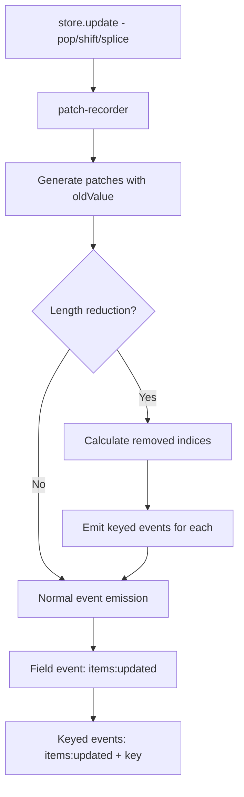

# Plan: Enhance observator with Keyed Events for Array Element Removal

## Overview

Enhance `observator` to emit keyed events for removed array indices when processing length change patches. This enables fine-grained reactivity for array element removal operations.

## Problem Statement

Currently, when array elements are removed via `pop()`, `shift()`, `splice()`, or length assignment:

1. Field-level event `items:updated` fires correctly
2. Keyed events for removed indices do NOT fire

Example:
```typescript
const store = createObservableStore({ items: [1, 2, 3, 4, 5] });

store.onKeyed('items:updated', 2, callback);  // Listen to index 2
store.update(s => s.items.pop());  // Remove index 4
store.update(s => s.items.pop());  // Remove index 3
store.update(s => s.items.pop());  // Remove index 2 - callback NOT called!
```

The keyed listener for index 2 never fires even though that index was removed.

## Prerequisites

This enhancement depends on `patch-recorder` providing `oldValue` in length change patches:

```json
{
  "op": "replace",
  "path": ["items", "length"],
  "value": 2,
  "oldValue": 5
}
```

See: `plans/patch-recorder-array-length-enhancement.md`

## Solution

Detect length reduction patches and emit keyed events for all removed indices.

## Implementation Steps

### Step 1: Update Patch Type to Include oldValue

Update the `Patch` type in `types.ts`:

```typescript
export type Patch<AsPath extends boolean = false> = {
  op: 'add' | 'remove' | 'replace';
  path: AsPath extends true ? PatchPath : (string | number)[];
  value?: unknown;
  oldValue?: unknown;  // NEW: Previous value for replace operations
};
```

### Step 2: Add Length Change Detection in update()

In `src/index.ts`, modify the `update()` method to detect and handle array length reductions:

```typescript
update(mutate: (state: T) => void): Patches {
  const [newState, patches] = this.create(this.state, mutate);
  this.state = newState;

  if (patches.length === 0) return patches;

  // Group patches by top-level field
  const patchesByField = new Map<string, Patches>();
  
  // ... existing grouping logic ...

  // NEW: Detect array length reductions for keyed events
  const lengthReductions: Array<{
    field: string;
    oldLength: number;
    newLength: number;
  }> = [];

  for (const patch of patches) {
    if (
      patch.path.length === 2 &&
      patch.path[1] === 'length' &&
      patch.op === 'replace' &&
      typeof patch.oldValue === 'number' &&
      typeof patch.value === 'number' &&
      patch.value < patch.oldValue
    ) {
      lengthReductions.push({
        field: String(patch.path[0]),
        oldLength: patch.oldValue,
        newLength: patch.value
      });
    }
  }

  // Emit field events (existing logic)
  for (const [field, fieldPatches] of patchesByField) {
    const eventName = `${field}:updated` as EventNames<T>;
    this.emitter.emit(eventName, fieldPatches);
    
    // ... existing keyed event logic ...
  }

  // NEW: Emit keyed events for removed array indices
  for (const reduction of lengthReductions) {
    const eventName = `${reduction.field}:updated` as EventNames<T>;
    
    if (this.emitter.hasKeyedListeners(eventName)) {
      const fieldPatches = patchesByField.get(reduction.field) || [];
      
      for (let i = reduction.newLength; i < reduction.oldLength; i++) {
        this.emitter.emitKeyed(eventName, i, fieldPatches);
      }
    }
  }

  // Emit wildcard event
  this.emitter.emit('*', patches);

  return patches;
}
```

### Step 3: Check for hasKeyedListeners Method

Ensure the emitter from `radiate` has a method to check for keyed listeners:

```typescript
// If not available, we can track it ourselves
private keyedListenerFields = new Set<string>();

onKeyed<K extends keyof T & string>(
  event: EventName<K>,
  key: Key | '*',
  callback: ...
): () => void {
  this.keyedListenerFields.add(event);
  // ... existing logic ...
}
```

### Step 4: Update Tests

Add tests for the new keyed event emission on array removal:

```typescript
describe('Array removal keyed events', () => {
  it('should emit keyed events for removed indices on pop', () => {
    type State = {
      items: Array<{ id: number }>;
    };

    const store = createObservableStore<State>({
      items: [{ id: 1 }, { id: 2 }, { id: 3 }]
    });

    const callback2 = vi.fn();
    store.onKeyed('items:updated', 2, callback2);

    store.update(s => s.items.pop());

    expect(callback2).toHaveBeenCalledTimes(1);
  });

  it('should emit keyed events for all removed indices on bulk removal', () => {
    type State = {
      items: Array<{ id: number }>;
    };

    const store = createObservableStore<State>({
      items: [{ id: 1 }, { id: 2 }, { id: 3 }, { id: 4 }, { id: 5 }]
    });

    const callback2 = vi.fn();
    const callback3 = vi.fn();
    const callback4 = vi.fn();

    store.onKeyed('items:updated', 2, callback2);
    store.onKeyed('items:updated', 3, callback3);
    store.onKeyed('items:updated', 4, callback4);

    store.update(s => s.items.length = 2);

    expect(callback2).toHaveBeenCalledTimes(1);
    expect(callback3).toHaveBeenCalledTimes(1);
    expect(callback4).toHaveBeenCalledTimes(1);
  });

  it('should emit keyed events on shift for all affected indices', () => {
    type State = {
      items: Array<{ id: number }>;
    };

    const store = createObservableStore<State>({
      items: [{ id: 1 }, { id: 2 }, { id: 3 }]
    });

    const callback0 = vi.fn();
    const callback1 = vi.fn();
    const callback2 = vi.fn();

    store.onKeyed('items:updated', 0, callback0);
    store.onKeyed('items:updated', 1, callback1);
    store.onKeyed('items:updated', 2, callback2);

    store.update(s => s.items.shift());

    // Index 0 now has {id:2}, index 1 has {id:3}, index 2 removed
    expect(callback0).toHaveBeenCalled();
    expect(callback1).toHaveBeenCalled();
    expect(callback2).toHaveBeenCalled();
  });

  it('should not emit keyed events when no keyed listeners exist', () => {
    type State = {
      items: Array<{ id: number }>;
    };

    const store = createObservableStore<State>({
      items: [{ id: 1 }, { id: 2 }, { id: 3 }]
    });

    const fieldCallback = vi.fn();
    store.on('items:updated', fieldCallback);

    store.update(s => s.items.pop());

    // Only field callback fires, no keyed event overhead
    expect(fieldCallback).toHaveBeenCalledTimes(1);
  });
});
```

### Step 5: Update observator-svelte Tests

Verify the Svelte reactivity tests work with the new behavior:

```typescript
it('should re-render when array element is popped', async () => {
  // Test that keyed subscriptions via proxy fire on pop
});
```

### Step 6: Update Documentation

Update AGENTS.md and README.md:

- Document the keyed event behavior for array removal
- Explain the relationship with patch-recorder's oldValue
- Provide examples of using keyed subscriptions with arrays

## Architecture Diagram



## Testing Checklist

- [ ] `pop()` emits keyed event for removed index
- [ ] `shift()` emits keyed events for all affected indices
- [ ] `splice()` emits keyed events for removed indices
- [ ] Direct length assignment emits keyed events for removed indices
- [ ] Bulk removal - 1000 to 0 elements - emits 1000 keyed events - if listeners exist
- [ ] No performance impact when no keyed listeners exist
- [ ] Works with nested arrays
- [ ] Works with arrays of objects
- [ ] Works with arrays of primitives
- [ ] Svelte proxy reactivity works correctly

## Success Criteria

1. Keyed events fire for all removed array indices
2. No keyed event overhead when no keyed listeners exist
3. All existing tests still pass
4. New tests verify array removal keyed events
5. Svelte integration works correctly
6. Documentation updated

## Dependencies

- `patch-recorder` version with `oldValue` support
- `radiate` emitter with `hasKeyedListeners()` or equivalent
