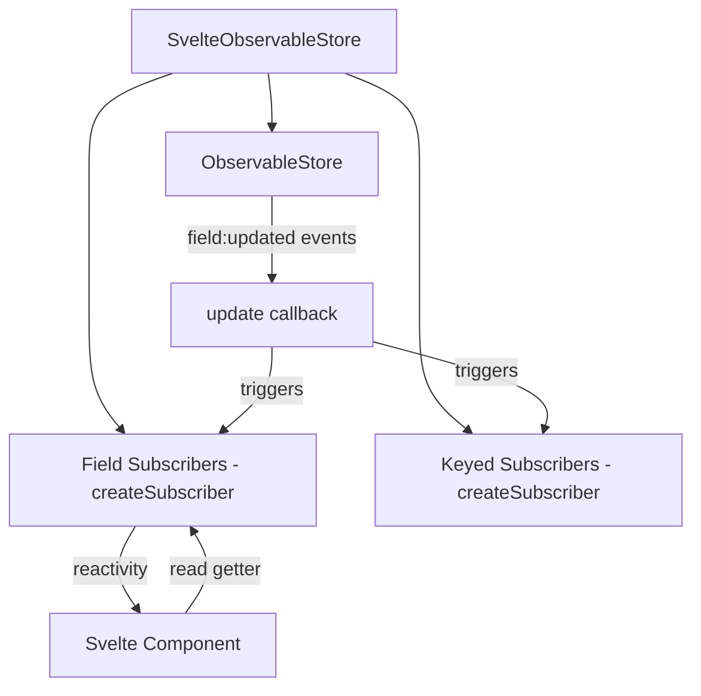

# ObservableStore + Svelte 5 Signals Integration Plan

## Overview

This document outlines the architecture for integrating `observator`'s `ObservableStore` with Svelte 5's reactivity system using `createSubscriber` from `svelte/reactivity`.

## Goals

1. **Fine-grained reactivity**: Components only re-render when specific fields they depend on change
2. **Type-safe**: Full TypeScript support for all APIs
3. **Svelte 5 idiomatic**: Use `createSubscriber` for proper external system integration
4. **Lazy subscription**: Subscriptions are created on-demand to minimize overhead
5. **Keyed subscriptions**: Support for watching specific keys in Records/Arrays

## Key Insight: createSubscriber

Svelte 5 provides `createSubscriber` from `svelte/reactivity` specifically for integrating external event-based systems. This is perfect for ObservableStore because:

1. It only subscribes when read inside an effect
2. It automatically cleans up when effects are destroyed
3. Multiple effects reading the same value share a single subscription
4. It's the official, idiomatic way to bridge external reactive systems

## Architecture

### Core Concept

We create a class that wraps `ObservableStore` and provides reactive getters using `createSubscriber`. When a getter is read inside an effect (including in Svelte templates), it becomes reactive.



### API Design

#### Creating a Svelte Observable Store

```typescript
import { createSvelteStore } from 'observator-svelte';

type State = {
  user: { name: string; age: number };
  counter: number;
  items: string[];
  users: Record<string, { name: string }>;
};

const store = createSvelteStore<State>({
  user: { name: 'John', age: 30 },
  counter: 0,
  items: [],
  users: {}
});
```

#### Reading State with Reactive Getters

```svelte
<script>
  import { store } from './store';
  
  // Fine-grained: only re-runs effect when user field changes
  // The getter automatically subscribes when read in an effect
</script>

<!-- Reading store.user triggers subscription to user:updated -->
<p>Name: {store.user.name}</p>
<p>Age: {store.user.age}</p>

<!-- Reading store.counter triggers subscription to counter:updated -->
<p>Count: {store.counter}</p>
```

#### Keyed Getter Access

```svelte
<script>
  import { store } from './store';
</script>

<!-- Access specific user by key with fine-grained reactivity -->
<p>User 123 name: {store.keyed.users('user-123')?.name}</p>
```

### Implementation Details

#### File: `src/lib/index.ts` - Main Entry Point

```typescript
export { createSvelteStore, type SvelteObservableStore } from './store.svelte.js';
export type * from './types.js';
```

#### File: `src/lib/store.svelte.ts` - Core Implementation

```typescript
import { createSubscriber } from 'svelte/reactivity';
import { createObservableStore, type ObservableStore, type ObservableStoreOptions } from 'observator';
import type { NonPrimitive, ExtractKeyType, EventName, Patches } from 'observator';

/**
 * SvelteObservableStore wraps ObservableStore with Svelte 5 reactive getters.
 * 
 * Uses createSubscriber to integrate ObservableStore's event system with 
 * Svelte's reactivity. Getters become reactive when read inside effects.
 * 
 * @example
 * ```svelte
 * <script>
 *   const store = createSvelteStore({ count: 0, user: { name: 'John' } });
 * </script>
 * 
 * <!-- Reactive: re-renders when count changes -->
 * <p>{store.count}</p>
 * 
 * <!-- Reactive: re-renders when user changes -->
 * <p>{store.user.name}</p>
 * ```
 */
export class SvelteObservableStore<T extends Record<string, unknown> & NonPrimitive> {
  private readonly observableStore: ObservableStore<T>;
  private readonly fieldSubscribers: Map<keyof T, () => void> = new Map();
  private readonly keyedSubscribers: Map<string, () => void> = new Map();
  
  /**
   * Keyed access for Record/Array fields.
   * Returns a function that takes a key and returns the value at that key.
   */
  public readonly keyed: KeyedAccessors<T>;
  
  constructor(initialState: T, options?: ObservableStoreOptions) {
    this.observableStore = createObservableStore(initialState, options);
    this.keyed = this.createKeyedAccessors();
    
    // Create reactive getters for each field
    this.createFieldGetters();
  }
  
  /**
   * Create reactive getter for a field using createSubscriber.
   * The subscription only activates when the getter is read inside an effect.
   */
  private getOrCreateFieldSubscriber<K extends keyof T>(field: K): () => void {
    if (!this.fieldSubscribers.has(field)) {
      const subscriber = createSubscriber((update) => {
        // Subscribe to field:updated event
        const eventName = `${String(field)}:updated` as EventName<K & string>;
        const unsubscribe = this.observableStore.on(eventName, () => {
          update(); // Trigger re-run of any effects reading this field
        });
        
        // Cleanup when all effects are destroyed
        return () => unsubscribe();
      });
      
      this.fieldSubscribers.set(field, subscriber);
    }
    return this.fieldSubscribers.get(field)!;
  }
  
  /**
   * Create reactive getters on `this` for each field in the state.
   * Uses Object.defineProperty to create getters that:
   * 1. Call the subscriber (making the read reactive)
   * 2. Return the current value from ObservableStore
   */
  private createFieldGetters(): void {
    const state = this.observableStore.getState();
    
    for (const field of Object.keys(state) as Array<keyof T>) {
      Object.defineProperty(this, field, {
        get: () => {
          // Make this read reactive by calling the subscriber
          this.getOrCreateFieldSubscriber(field)();
          // Return current value
          return this.observableStore.get(field);
        },
        enumerable: true,
        configurable: false
      });
    }
  }
  
  /**
   * Create keyed accessors for Record/Array fields.
   * Provides fine-grained reactivity for specific keys.
   */
  private createKeyedAccessors(): KeyedAccessors<T> {
    const accessors = {} as KeyedAccessors<T>;
    const state = this.observableStore.getState();
    
    for (const field of Object.keys(state) as Array<keyof T>) {
      accessors[field] = ((key: ExtractKeyType<T[typeof field]>) => {
        const cacheKey = `${String(field)}:${String(key)}`;
        
        if (!this.keyedSubscribers.has(cacheKey)) {
          const subscriber = createSubscriber((update) => {
            const eventName = `${String(field)}:updated` as EventName<typeof field & string>;
            const unsubscribe = this.observableStore.onKeyed(eventName, key as any, () => {
              update();
            });
            return () => unsubscribe();
          });
          this.keyedSubscribers.set(cacheKey, subscriber);
        }
        
        // Make read reactive
        this.keyedSubscribers.get(cacheKey)!();
        
        // Return value at key
        const fieldValue = this.observableStore.get(field);
        if (Array.isArray(fieldValue)) {
          return fieldValue[key as number];
        } else if (fieldValue && typeof fieldValue === 'object') {
          return (fieldValue as Record<any, any>)[key];
        }
        return undefined;
      }) as any;
    }
    
    return accessors;
  }
  
  /**
   * Update state - delegates to ObservableStore.
   * After mutation, affected field subscribers will trigger re-renders.
   */
  public update(mutate: (state: T) => void): Patches {
    return this.observableStore.update(mutate);
  }
  
  /**
   * Get raw value without triggering reactivity.
   * Useful when you need the value but don't want to subscribe.
   */
  public getRaw<K extends keyof T>(field: K): Readonly<T[K]> {
    return this.observableStore.get(field);
  }
  
  /**
   * Get entire state without triggering per-field reactivity.
   */
  public getState(): Readonly<T> {
    return this.observableStore.getState();
  }
  
  /**
   * Access the underlying ObservableStore for advanced usage.
   * Useful for event-based subscriptions, patches, etc.
   */
  public get raw(): ObservableStore<T> {
    return this.observableStore;
  }
}

// Type for keyed accessors
type KeyedAccessors<T extends Record<string, unknown>> = {
  [K in keyof T]: (key: ExtractKeyType<T[K]>) => T[K] extends Array<infer V> 
    ? V | undefined 
    : T[K] extends Record<any, infer V> 
      ? V | undefined 
      : T[K] | undefined;
};

// Type that includes dynamic field getters
export type SvelteObservableStoreWithFields<T extends Record<string, unknown> & NonPrimitive> = 
  SvelteObservableStore<T> & {
    readonly [K in keyof T]: T[K];
  };

/**
 * Create a SvelteObservableStore with reactive getters for each field.
 */
export function createSvelteStore<T extends Record<string, unknown> & NonPrimitive>(
  initialState: T,
  options?: ObservableStoreOptions
): SvelteObservableStoreWithFields<T> {
  return new SvelteObservableStore(initialState, options) as SvelteObservableStoreWithFields<T>;
}
```

### How It Works

1. **Field Getters**: Each field in the state gets a getter defined on the store instance. When accessed, the getter:
   - Calls the `createSubscriber` callback (registering reactivity if in an effect)
   - Returns the current value from ObservableStore

2. **Lazy Subscription**: `createSubscriber` only subscribes to ObservableStore events when:
   - The getter is read inside a Svelte effect (template, `$effect`, `$derived`)
   - The subscription is created once and shared across effects

3. **Automatic Cleanup**: When all effects reading a field are destroyed, `createSubscriber` calls the cleanup function, which unsubscribes from ObservableStore events.

4. **Keyed Access**: The `keyed` property provides functions for each field that take a key and return the value at that key, with fine-grained reactivity using `onKeyed`.

### File Structure

```
packages/observator-svelte/
├── src/
│   └── lib/
│       ├── index.ts              # Main exports
│       ├── store.svelte.ts       # SvelteObservableStore class
│       └── types.ts              # TypeScript types (optional)
├── test/
│   └── store.svelte.test.ts      # Unit tests
```

## Package Dependencies

Update `package.json`:

```json
{
  "dependencies": {
    "observator": "workspace:*"
  },
  "peerDependencies": {
    "svelte": "^5.0.0"
  }
}
```

## Testing Strategy

### Unit Tests

1. Test that getters return correct values
2. Test that `update` propagates changes correctly
3. Test keyed access returns correct values
4. Test that subscribers work with createSubscriber

### Integration Tests with Svelte Components

Test that components re-render correctly when:
1. A single field changes (only that field's consumers re-render)
2. Multiple fields change in one update
3. Keyed values change

## Example Usage

### Counter Example

```svelte
<!-- Counter.svelte -->
<script>
  import { createSvelteStore } from 'observator-svelte';
  
  const store = createSvelteStore({
    count: 0,
    user: { name: 'John' }
  });
  
  function increment() {
    store.update(s => { s.count += 1; });
  }
</script>

<!-- Only this re-renders when count changes -->
<p>Count: {store.count}</p>

<!-- This does NOT re-render when count changes -->
<p>User: {store.user.name}</p>

<button onclick={increment}>+1</button>
```

### Users Record with Keyed Access

```svelte
<!-- UserList.svelte -->
<script>
  import { createSvelteStore } from 'observator-svelte';
  
  type State = {
    users: Record<string, { name: string; online: boolean }>;
    selectedId: string | null;
  };
  
  const store = createSvelteStore<State>({
    users: {
      'alice': { name: 'Alice', online: true },
      'bob': { name: 'Bob', online: false }
    },
    selectedId: null
  });
  
  function toggleOnline(id: string) {
    store.update(s => {
      s.users[id].online = !s.users[id].online;
    });
  }
</script>

<!-- Fine-grained: each UserRow only re-renders when its specific user changes -->
{#each Object.keys(store.users) as id}
  <UserRow 
    user={store.keyed.users(id)} 
    ontoggle={() => toggleOnline(id)} 
  />
{/each}
```

### Using with $derived

```svelte
<script>
  import { createSvelteStore } from 'observator-svelte';
  
  const store = createSvelteStore({
    items: [1, 2, 3, 4, 5]
  });
  
  // Derived value - only recalculates when items changes
  const sum = $derived(store.items.reduce((a, b) => a + b, 0));
</script>

<p>Sum: {sum}</p>
```

### Using with $effect

```svelte
<script>
  import { createSvelteStore } from 'observator-svelte';
  
  const store = createSvelteStore({
    query: '',
    results: []
  });
  
  // Effect runs when query changes
  $effect(() => {
    const q = store.query;
    if (q.length > 2) {
      fetch(`/api/search?q=${q}`)
        .then(r => r.json())
        .then(data => {
          store.update(s => { s.results = data; });
        });
    }
  });
</script>

<input bind:value={store.query} />
```

## Comparison with $state

| Feature | createSubscriber | $state |
|---------|------------------|--------|
| External integration | ✅ Designed for it | ❌ Not suitable |
| Lazy subscription | ✅ Only when read in effect | ❌ Always reactive |
| Automatic cleanup | ✅ Built-in | ❌ Manual cleanup |
| Event-based sources | ✅ Perfect fit | ❌ Requires manual sync |
| Memory efficiency | ✅ Shared subscriptions | ❌ Per-reference |

## Summary

This integration uses Svelte 5's `createSubscriber` to properly bridge ObservableStore's event-based reactivity with Svelte's reactivity system:

1. **Idiomatic Svelte 5**: Uses the official API for external reactive systems
2. **Fine-grained**: Each field has its own subscription
3. **Lazy**: Subscriptions only created when values are read in effects
4. **Automatic cleanup**: Svelte handles subscription lifecycle
5. **Type-safe**: Full TypeScript support
6. **Keyed subscriptions**: Fine-grained reactivity for Record/Array fields
