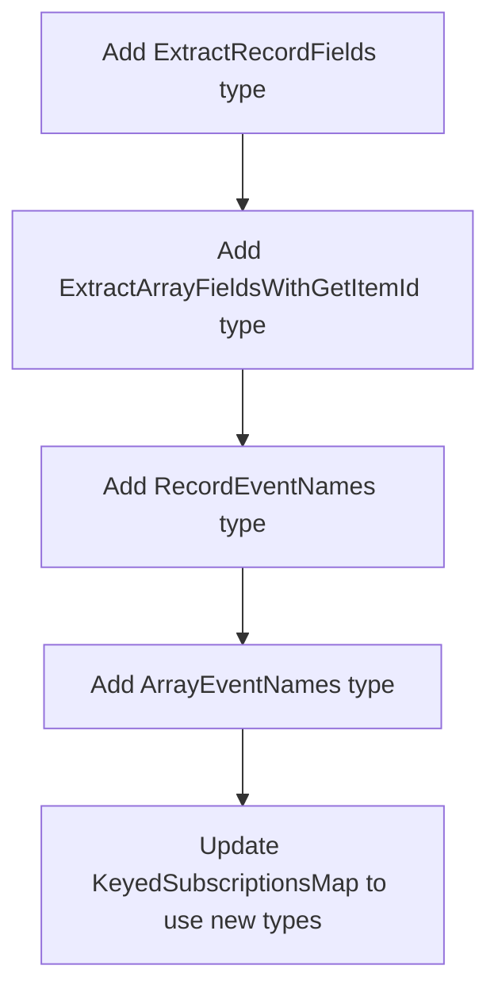

# API Refactoring Plan: `onKeyed` → `onKey` (Records) + `onItemId` (Arrays)

## Problem Statement

The current `onKeyed` API has inconsistent behavior between Records and Arrays:

| Scenario | Records | Arrays with getItemId |
|----------|---------|----------------------|
| Key/Item property updated | ✅ Callback fires | ✅ Callback fires |
| Key/Item deleted/removed | ✅ Callback fires | ❌ Callback does NOT fire |
| Field replaced entirely | ✅ All callbacks fire | ❌ No callbacks fire |

This inconsistency can confuse users who expect symmetric behavior.

## Solution

Split `onKeyed` into two separate, clearly-named APIs:

1. **`onKey`** - For Record fields only (excludes array fields at type level)
2. **`onItemId`** - For Array fields with `getItemId` configuration only

This makes the behavioral difference explicit through naming and TypeScript types.

## Detailed Changes

### Phase 1: Type System Updates

#### File: `packages/observator/src/types.ts`



**New Types to Add:**

```typescript
// Extract only Record field names from state type
// Excludes Array fields
export type ExtractRecordFields<T extends Record<string, unknown>> = {
  [K in keyof T]: T[K] extends Array<any> ? never : K;
}[keyof T];

// Extract only Array field names from state type
export type ExtractArrayFields<T extends Record<string, unknown>> = {
  [K in keyof T]: T[K] extends Array<any> ? K : never;
}[keyof T];

// Event names for Record fields only
export type RecordEventNames<T extends Record<string, unknown>> = 
  EventName<ExtractRecordFields<T> & string>;

// Event names for Array fields only  
export type ArrayEventNames<T extends Record<string, unknown>> = 
  EventName<ExtractArrayFields<T> & string>;

// Extract key type for Records - only allows Key types
export type ExtractRecordKeyType<T> = 
  T extends Record<infer K, any> 
    ? K extends Key ? K : string 
    : never;

// Extract ID type from array item based on getItemId return type
export type ExtractItemIdType<T> = 
  T extends Array<infer Item> 
    ? string | number  // getItemId always returns string | number | null | undefined
    : never;
```

---

### Phase 2: New API Methods

#### File: `packages/observator/src/index.ts`

**Add `onKey` method:**

```typescript
/**
 * Subscribe to updates for a specific key in a Record field.
 * 
 * NOTE: This method is for Record fields only. For arrays, use `onItemId`.
 * 
 * @param event - Record field event name in format `${fieldName}:updated`
 * @param key - The specific Record key to listen for
 * @param callback - Callback function that receives the patches array
 * @returns Unsubscribe function
 * 
 * @example
 * ```ts
 * // Subscribe to specific user changes in a Record
 * const unsubscribe = store.onKey('users:updated', 'user-123', patches => {
 *   console.log('User 123 changed:', patches);
 * });
 * ```
 */
public onKey<K extends ExtractRecordFields<T>>(
  event: EventName<K & string>,
  key: Key,
  callback: (patches: Patches) => void,
): () => void;

// Wildcard overload
public onKey<K extends ExtractRecordFields<T>>(
  event: EventName<K & string>,
  key: '*',
  callback: (key: ExtractRecordKeyType<T[K]>, patches: Patches) => void,
): () => void;
```

**Add `onItemId` method:**

```typescript
/**
 * Subscribe to updates for a specific item ID in an Array field.
 * 
 * NOTE: This method requires getItemId to be configured for the array field.
 * For Record fields, use `onKey` instead.
 * 
 * IMPORTANT: This callback ONLY fires when the item's properties are updated,
 * NOT when the item is removed or the array is replaced. Use `on` for those cases.
 * 
 * @param event - Array field event name in format `${fieldName}:updated`
 * @param itemId - The item ID to listen for (as returned by getItemId)
 * @param callback - Callback function that receives the patches array
 * @returns Unsubscribe function
 * 
 * @example
 * ```ts
 * const store = createObservableStore(
 *   { todos: [{ id: 'todo-1', text: 'Hello' }] },
 *   { getItemId: { todos: item => item.id } }
 * );
 * 
 * // Subscribe to specific todo item changes
 * const unsubscribe = store.onItemId('todos:updated', 'todo-1', patches => {
 *   console.log('Todo 1 updated:', patches);
 * });
 * ```
 */
public onItemId<K extends ExtractArrayFields<T>>(
  event: EventName<K & string>,
  itemId: string | number,
  callback: (patches: Patches) => void,
): () => void;

// Wildcard overload
public onItemId<K extends ExtractArrayFields<T>>(
  event: EventName<K & string>,
  itemId: '*',
  callback: (itemId: string | number, patches: Patches) => void,
): () => void;
```

---

### Phase 3: Corresponding Methods

Add matching `off*` and `once*` methods:

| Current Method | Records Version | Arrays Version |
|----------------|-----------------|----------------|
| `onKeyed` | `onKey` | `onItemId` |
| `offKeyed` | `offKey` | `offItemId` |
| `onceKeyed` | `onceKey` | `onceItemId` |

---

### Phase 4: Internal Logic Updates

#### Update `update()` method event emission:

```typescript
// Emit keyed events only when there are listeners
if (this.emitter.hasKeyedListeners(eventName)) {
  const isArrayField = this.arrayFields.has(fieldKey);
  
  if (isArrayField) {
    // For arrays: only emit for patches with patch.id
    // These are tracked by onItemId listeners
    const changedIds = this.extractItemIdsFromPatches(fieldPatches);
    for (const itemId of changedIds) {
      this.emitter.emitKeyed(eventName, itemId as any, fieldPatches as any);
    }
  } else {
    // For records: extract keys from patch paths
    // Handle replacement and deletion
    const changedKeys = this.extractRecordKeysFromPatches(fieldPatches);
    
    if (replacedFields.has(fieldKey)) {
      // Notify all registered key listeners on full replacement
      const registeredKeys = this.emitter.getKeyedListenerKeys(eventName);
      for (const key of registeredKeys) {
        changedKeys.add(key as Key);
      }
    }
    
    for (const changedKey of changedKeys) {
      this.emitter.emitKeyed(eventName, changedKey as any, fieldPatches as any);
    }
  }
}
```

---

### Phase 5: Remove Old API

Since there are no existing users of the library, we can directly remove:
- `onKeyed`
- `offKeyed`
- `onceKeyed`
- `keyedSubscriptions` map

No deprecation warnings or migration period needed.

---

### Phase 6: Update keyedSubscriptions Map

Split into two separate maps:

```typescript
// Current
public keyedSubscriptions: KeyedSubscriptionsMap<T>;

// New
public keySubscriptions: RecordKeySubscriptionsMap<T>;
public itemIdSubscriptions: ArrayItemIdSubscriptionsMap<T>;
```

With new types:

```typescript
export type RecordKeySubscriptionsMap<T extends Record<string, unknown>> = {
  [K in ExtractRecordFields<T>]: {
    (key: ExtractRecordKeyType<T[K]>): (callback: (value: Readonly<T[K]>) => void) => () => void;
  };
};

export type ArrayItemIdSubscriptionsMap<T extends Record<string, unknown>> = {
  [K in ExtractArrayFields<T>]: {
    (itemId: string | number): (callback: (value: Readonly<T[K]>) => void) => () => void;
  };
};
```

---

## Test Changes Required

### Tests to Update

1. All existing `onKeyed` tests need to be split:
   - Tests with Record fields → use `onKey`
   - Tests with Array fields + getItemId → use `onItemId`

2. Add new type safety tests:
   ```typescript
   it('should not allow onKey on array fields', () => {
     type State = { items: string[] };
     const store = createObservableStore<State>({ items: [] });
     
     // @ts-expect-error - onKey should not work on array fields
     store.onKey('items:updated', 0, () => {});
   });
   
   it('should not allow onItemId on record fields', () => {
     type State = { users: Record<string, { name: string }> };
     const store = createObservableStore<State>({ users: {} });
     
     // @ts-expect-error - onItemId should not work on record fields
     store.onItemId('users:updated', 'user-1', () => {});
   });
   ```

3. Add runtime error tests:
   ```typescript
   it('should throw if onItemId used without getItemId config', () => {
     type State = { items: Array<{ id: string }> };
     const store = createObservableStore<State>({ items: [] });
     // No getItemId configured
     
     expect(() => {
       store.onItemId('items:updated', 'a', () => {});
     }).toThrow('onItemId requires getItemId configuration');
   });
   ```

---

## Documentation Updates

### README.md Changes

1. Update subscription examples to use new API
2. Add clear documentation about:
   - `onKey` for Records - fires on update, delete, and replacement
   - `onItemId` for Arrays - fires ONLY on property updates, NOT removal
3. Add migration guide from `onKeyed`

### JSDoc Updates

All new methods should have comprehensive JSDoc with:
- Clear description of when callbacks fire
- Examples for both specific keys and wildcards
- Notes about behavioral differences

---

## Implementation Order

1. **Types first** - Add new types to `types.ts`
2. **New methods** - Add `onKey`, `onItemId` and related methods
3. **Internal refactor** - Split emission logic
4. **Deprecate old API** - Mark `onKeyed` as deprecated
5. **Tests** - Update all tests
6. **Documentation** - Update README and JSDoc
7. **Release** - Minor version bump with deprecation warnings

---

## Risk Assessment

| Risk | Mitigation |
|------|------------|
| Breaking existing code | Use deprecation period, keep `onKeyed` working |
| Type complexity | Thorough testing with `@ts-expect-error` assertions |
| Runtime behavior change | No behavior change, only naming |
| observator-svelte impact | Will need corresponding updates |

---

## Acceptance Criteria

- [ ] `onKey` only accepts Record field event names (TypeScript error otherwise)
- [ ] `onItemId` only accepts Array field event names (TypeScript error otherwise)
- [ ] `onItemId` throws runtime error if getItemId not configured for field
- [ ] All existing tests pass with updated API
- [ ] New type safety tests pass
- [ ] `onKeyed` shows deprecation warning but still works
- [ ] README updated with new API and migration guide
- [ ] observator-svelte package updated if needed
